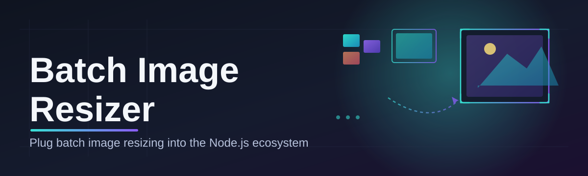
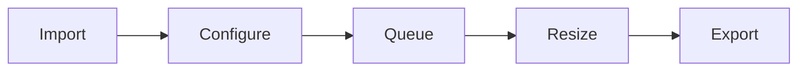

# batch-image-resizer-tool 🖼️⚡

  

*Thousands of images. One drop zone. Zero patience required.*

## 🌱 Overview

Every designer, photographer, and web team eventually hits the same wall: a folder with 4,000 product photos that all need to be 1200px wide, or a camera roll full of 20MB RAW exports that need to become lightweight JPEGs before they touch a CMS. Doing that one file at a time in a heavyweight editor is the kind of busywork that quietly eats an afternoon. **batch-image-resizer-tool** exists to close that gap — a focused, native Windows utility built around a single idea: resizing images in bulk should take minutes, not meetings.

The project started as an internal script passed between a handful of front-end developers who got tired of writing the same resize-and-compress routine for every new client site. Over time it grew a proper interface, a queueing engine, and enough polish that it made sense to open it up. Today it's used by e-commerce teams prepping catalog images, indie game devs batching sprite assets, and photographers who just want their exports web-ready without opening Lightroom.

This isn't a bloated suite trying to be Photoshop. It's a **batch image resizer** in the purest sense — drag folders in, define your output rules once, and let it chew through thousands of files while you do literally anything else. No accounts, no cloud uploads, no telemetry-hungry background processes. Just pixels, in and out, fast.

  

---

## 🎛️ What It Actually Does

> [!TIP]
> Every capability below runs entirely offline — your images never leave your machine.

- **Bulk dimension control** — set target width, height, or both, with lock-aspect-ratio and "fit within bounds" modes so nothing gets stretched or squashed.

- **Format conversion on the fly** — convert between JPEG, PNG, WEBP, and BMP as part of the same resize pass, no separate export step.

- **Smart compression presets** — quality sliders tuned per format so you can hit a target file size without babysitting each image.

- **Recursive folder processing** — point it at a parent directory and it walks every subfolder, preserving your original structure in the output.

- **Rename-on-export patterns** — sequential numbering, prefix/suffix templates, and original-name preservation, all configurable before the batch starts.

- **Metadata handling** — strip EXIF data for privacy-conscious exports, or keep it intact for archival workflows.

- **Live thumbnail preview** — see exactly how your resize settings affect a sample image before committing to the full queue.

- **Pause, resume, and skip** — long batches don't have to be all-or-nothing; interrupt a job and pick it back up later.

> [!NOTE]
> Watermarking and cropping presets are on the roadmap — track progress in the Issues tab if you want to weigh in.

---

## 🚀 Getting Started

Getting from "downloaded" to "first batch resized" takes about ninety seconds.

1. **Visit the landing page** using the button above and grab the latest build.

2. **Run the executable** — it's a standalone binary, so there's nothing to configure before first launch.

3. **Drop your images or folders** into the queue window, either by drag-and-drop or the built-in file browser.

4. **Set your output rules** (dimensions, format, destination folder) and hit Start Batch.

> [!IMPORTANT]
> Windows SmartScreen may flag the executable on first run simply because it's an unsigned indie build. Click "More info" → "Run anyway" to proceed — this is expected behavior for new binaries, not a warning sign.

---

## 🧾 System Requirements

| Component | Minimum | Recommended |
|---|---|---|
| **OS** | Windows 10 (64-bit) | Windows 11 (64-bit) |
| **RAM** | 4 GB | 8 GB or more |
| **Disk** | 150 MB free | 500 MB free (for large batch output) |
| **CPU** | Dual-core, 2.0 GHz | Quad-core, 2.5 GHz+ |
| **Display** | 1280x720 | 1920x1080 |

<strong>Why does batch size affect disk requirements?</strong>

 

Resized copies are written alongside — or in place of — the originals depending on your output settings. Processing several thousand images at once means temporary buffer files and final exports both need breathing room. If you're batching entire photo libraries, budget disk space accordingly.

---

## 🧠 How It Works

The engine behind batch-image-resizer-tool is deliberately simple, which is exactly why it's fast:

1. **Ingest** — the app scans selected files/folders and builds a job queue, validating formats up front.
2. **Configure** — your resize, compression, and naming rules are applied as a reusable job template.
3. **Process** — a multi-threaded resize pipeline works through the queue, image by image.
4. **Export** — outputs are written to your chosen destination, preserving folder structure if enabled.
5. **Report** — a summary log shows successes, skips, and any files that failed validation.

---

## 🩹 Troubleshooting

**Q: The app resized my images but the output folder is empty — where did they go?**
A: Check your destination path setting; if it was left as "Same as source," resized files land next to the originals with a suffix rather than in a new folder.

**Q: Why does WEBP export look different from JPEG at the same quality setting?**
A: Compression algorithms differ between formats — WEBP typically achieves smaller file sizes at visually comparable quality, but the two scales aren't 1:1.

**Q: My batch stalled partway through a few thousand files.**
A: This is almost always a corrupted source file breaking the queue. Use the skip-and-continue option in Settings so one bad file doesn't halt the whole job.

**Q: Can I resize animated GIFs?**
A: Frame-by-frame GIF resizing is not yet supported — static formats only for now.

**Q: The app won't launch after downloading.**
A: Confirm the download completed fully and that antivirus software isn't quarantining the executable; unsigned builds occasionally get flagged incorrectly.

**Q: Does it overwrite my original images?**
A: Only if you explicitly set the output path to match the source folder — the default behavior always writes to a separate destination.

---

## 🎨 UI, UX & Customization

| Shortcut | Action |
|---|---|
| `Ctrl + O` | Open files/folder |
| `Ctrl + Enter` | Start batch |
| `Space` | Pause/resume queue |
| `Ctrl + Shift + P` | Open preview panel |
| `Esc` | Cancel current job |

The interface ships in **Light** and **Dark** themes, auto-detected from your Windows theme setting on first launch. Queue view, grid view, and a compact list mode are all available from the toolbar depending on how many files you're staring down.

> [!NOTE]
> Settings — including your last-used resize presets — are stored locally in a config file next to the executable. Nothing is synced anywhere.

  

---

## 🤝 Contributing & Community

Bug reports, feature requests, and pull requests are all genuinely welcome — this project grew out of real workflow frustration, and it keeps improving because people using it in the wild speak up.

> Before opening an issue, a quick search of existing ones saves everyone time — chances are your edge case has come up before.

If you're contributing code, keep changes focused and include a short description of the workflow it improves. UI mockups for proposed features are especially appreciated since the design philosophy here favors clarity over feature-cramming.

---

## 📜 License

Released under the [MIT License](LICENSE), 2026. Use it, fork it, build on it — just keep the license notice intact.

---

## ⚠️ Disclaimer

> [!WARNING]
> This tool processes files locally and does not create backups automatically. Always keep a copy of your original images before running batch operations, especially with overwrite-enabled settings.

batch-image-resizer-tool is provided as-is, with no warranty of any kind. The maintainers are not responsible for data loss resulting from misconfigured output paths or third-party antivirus interference.

---

  

